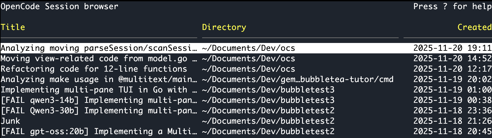

# ocs - Opencode Session Browser

## Description
`ocs` is a terminal user interface (TUI) application for browsing and launching opencode sessions. It scans the opencode session storage directory for JSON files, extracts metadata (session ID, title, working directory, and creation timestamp), and displays them in an interactive table. You can navigate the table, select a session with Enter to launch it in opencode, and return to the browser after closing opencode. Features include column toggling, help modal, and responsive layout.

## Features
- **Interactive Table**: Browse sessions with columns for ID, Title, Directory (abbreviated with ~), and Created timestamp.
- **Column Toggling**: Toggle visibility of columns with i (ID), t (Title), d (Directory), c (Created).
- **Help Modal**: Press ? for keybindings help.
- **Full-Screen Mode**: Uses alternate screen for a clean, distraction-free interface.
- **Cursor Persistence**: Remembers the last selected row when returning from opencode.
- **Session Launching**: Runs `opencode -s <session_id>` in the session's working directory.
- **View Session**: Press v to view session messages using python3 tool/ocs_messages.py piped to glow (if available), less, or more.
- **New Session**: Press n to start a new opencode session.
- **Refresh**: Press r to reload sessions.
- **Configurable Directory**: Specify the session storage directory with `-dir` (default: `~/.local/share/opencode/storage/session`).
- **Debug Mode**: Enable debug output with `-debug`.

## Installation
1. Ensure you have Go installed.
2. Clone or download the project.
3. Run `make install` to build and install `ocs` to `~/.local/bin`.
4. Run `ocs` to start the application (ensure `~/.local/bin` is in your PATH).

## Usage
- **Navigation**: Use arrow keys or vim-style keys (h/j/k/l) to move in the table.
- **Select Session**: Press Enter on a session to launch it in opencode.
- **View Session**: Press v to view the selected session's messages.
- **New Session**: Press n to start a new opencode session.
- **Refresh**: Press r to reload sessions.
- **Help**: Press ? to show keybindings.
- **Column Toggles**: i (ID), t (Title), d (Directory), c (Created).
- **Quit**: Press q, Ctrl+D, or Ctrl+C to exit.
- **Resize**: The table automatically adjusts to terminal size.

## Flags
- `-dir string`: Directory to scan for session JSON files (default `~/.local/share/opencode/storage/session`)
- `-debug`: Enable debug output

## Dependencies
- [tview](https://github.com/rivo/tview) for TUI framework
- [tcell](https://github.com/gdamore/tcell) for terminal handling
- python3 for viewing session messages
- glow (optional, for enhanced markdown rendering)
- less or more (for paging output)
